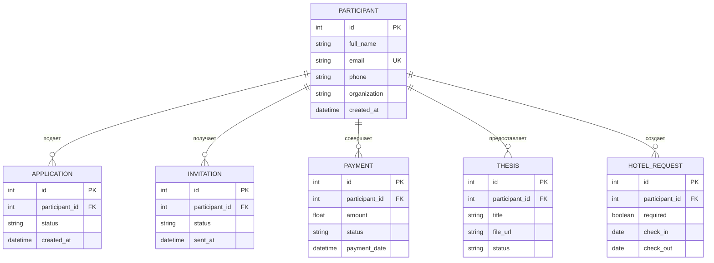

# Схема данных Conference Management System

## 1. Общие сведения

Conference Management System использует реляционную базу данных PostgreSQL.

В системе используются следующие сущности:

* `Participant` — участник конференции;
* `Application` — заявка на участие;
* `Invitation` — приглашение;
* `Payment` — организационный взнос;
* `Thesis` — тезисы участника;
* `HotelRequest` — заявка на размещение в гостинице.

Центральной сущностью является `Participant`. Остальные сущности связаны с участником через внешний ключ `participant_id`.

## 2. Схема связей


## 3. Обозначения

В схеме используются следующие обозначения:

| Обозначение | Значение |
|---|---|
| `PK` | Primary Key — первичный ключ |
| `FK` | Foreign Key — внешний ключ |
| `UK` | Unique Key — уникальное значение |
| <code>&#124;&#124;</code> | Ровно одна связанная запись |
| `o{` | Ноль или несколько связанных записей |

Связь:

```text
PARTICIPANT ||--o{ APPLICATION
```

означает:

* каждая заявка `Application` обязательно принадлежит одному участнику;
* один участник может не иметь заявок;
* один участник может иметь несколько заявок.

Аналогичный принцип используется для приглашений, платежей, тезисов и заявок на гостиницу.

## 4. Таблица `participants`

Таблица хранит сведения об участниках конференции.

Имя таблицы в базе данных:

```text
participants
```

| Поле           | Тип SQLAlchemy | Тип базы данных | Ограничения                          | Назначение                         |
| -------------- | -------------- | --------------- | ------------------------------------ | ---------------------------------- |
| `id`           | `Integer`      | `INTEGER`       | `PRIMARY KEY`, индекс                | Уникальный идентификатор участника |
| `full_name`    | `String(255)`  | `VARCHAR(255)`  | `NOT NULL`                           | ФИО участника                      |
| `email`        | `String(255)`  | `VARCHAR(255)`  | `NOT NULL`, `UNIQUE`, индекс         | Электронная почта участника        |
| `phone`        | `String(50)`   | `VARCHAR(50)`   | Может быть `NULL`                    | Номер телефона                     |
| `organization` | `String(255)`  | `VARCHAR(255)`  | Может быть `NULL`                    | Организация участника              |
| `created_at`   | `DateTime`     | `TIMESTAMP`     | `NOT NULL`, значение сервера `NOW()` | Дата и время создания записи       |

Особенности:

* поле `email` обязательно;
* значение `email` должно быть уникальным;
* `phone` и `organization` являются необязательными;
* `created_at` автоматически заполняется сервером базы данных.

## 5. Таблица `applications`

Таблица хранит заявки участников на участие в конференции.

Имя таблицы в базе данных:

```text
applications
```

| Поле             | Тип SQLAlchemy | Тип базы данных | Ограничения                          | Назначение                      |
| ---------------- | -------------- | --------------- | ------------------------------------ | ------------------------------- |
| `id`             | `Integer`      | `INTEGER`       | `PRIMARY KEY`, индекс                | Уникальный идентификатор заявки |
| `participant_id` | `Integer`      | `INTEGER`       | `NOT NULL`, `FOREIGN KEY`            | Идентификатор участника         |
| `status`         | `String(50)`   | `VARCHAR(50)`   | `NOT NULL`, по умолчанию `pending`   | Статус заявки                   |
| `created_at`     | `DateTime`     | `TIMESTAMP`     | `NOT NULL`, значение сервера `NOW()` | Дата и время создания заявки    |

Внешний ключ:

```text
applications.participant_id → participants.id
```

Каждая заявка обязательно принадлежит одному участнику.

Один участник может иметь ноль или несколько заявок.

### Основное бизнес-правило

Заявку нельзя перевести в статус:

```text
confirmed
```

если у связанного участника отсутствует платёж со статусом:

```text
paid
```

При попытке подтвердить заявку без оплаты сервер должен вернуть:

```text
409 Conflict
```

После регистрации оплаченного организационного взноса заявка может быть подтверждена.

## 6. Таблица `invitations`

Таблица хранит приглашения участников.

Имя таблицы в базе данных:

```text
invitations
```

| Поле             | Тип SQLAlchemy | Тип базы данных | Ограничения                        | Назначение                           |
| ---------------- | -------------- | --------------- | ---------------------------------- | ------------------------------------ |
| `id`             | `Integer`      | `INTEGER`       | `PRIMARY KEY`, индекс              | Уникальный идентификатор приглашения |
| `participant_id` | `Integer`      | `INTEGER`       | `NOT NULL`, `FOREIGN KEY`          | Идентификатор участника              |
| `status`         | `String(50)`   | `VARCHAR(50)`   | `NOT NULL`, по умолчанию `created` | Статус приглашения                   |
| `sent_at`        | `DateTime`     | `TIMESTAMP`     | Может быть `NULL`                  | Дата и время отправки приглашения    |

Внешний ключ:

```text
invitations.participant_id → participants.id
```

Каждое приглашение обязательно принадлежит одному участнику.

Один участник может иметь ноль или несколько приглашений.

Поле `sent_at` может оставаться пустым, пока приглашение не отправлено.

## 7. Таблица `payments`

Таблица хранит сведения об организационных взносах участников.

Имя таблицы в базе данных:

```text
payments
```

| Поле             | Тип SQLAlchemy | Тип базы данных | Ограничения                        | Назначение                       |
| ---------------- | -------------- | --------------- | ---------------------------------- | -------------------------------- |
| `id`             | `Integer`      | `INTEGER`       | `PRIMARY KEY`, индекс              | Уникальный идентификатор платежа |
| `participant_id` | `Integer`      | `INTEGER`       | `NOT NULL`, `FOREIGN KEY`          | Идентификатор участника          |
| `amount`         | `Float`        | `FLOAT`         | `NOT NULL`                         | Сумма организационного взноса    |
| `status`         | `String(50)`   | `VARCHAR(50)`   | `NOT NULL`, по умолчанию `pending` | Статус платежа                   |
| `payment_date`   | `DateTime`     | `TIMESTAMP`     | Может быть `NULL`                  | Дата и время оплаты              |

Внешний ключ:

```text
payments.participant_id → participants.id
```

Каждый платёж обязательно принадлежит одному участнику.

Один участник может иметь ноль или несколько платежей.

Поле `payment_date` может быть пустым, если платёж ещё не был выполнен.

Платёж со статусом `paid` позволяет подтвердить заявку соответствующего участника.

## 8. Таблица `theses`

Таблица хранит сведения о тезисах участников.

Имя таблицы в базе данных:

```text
theses
```

| Поле             | Тип SQLAlchemy | Тип базы данных | Ограничения                          | Назначение                       |
| ---------------- | -------------- | --------------- | ------------------------------------ | -------------------------------- |
| `id`             | `Integer`      | `INTEGER`       | `PRIMARY KEY`, индекс                | Уникальный идентификатор тезисов |
| `participant_id` | `Integer`      | `INTEGER`       | `NOT NULL`, `FOREIGN KEY`            | Идентификатор участника          |
| `title`          | `String(255)`  | `VARCHAR(255)`  | `NOT NULL`                           | Название тезисов                 |
| `file_url`       | `String(500)`  | `VARCHAR(500)`  | Может быть `NULL`                    | Ссылка или путь к файлу тезисов  |
| `status`         | `String(50)`   | `VARCHAR(50)`   | `NOT NULL`, по умолчанию `submitted` | Статус обработки тезисов         |

Внешний ключ:

```text
theses.participant_id → participants.id
```

Каждые тезисы обязательно принадлежат одному участнику.

Один участник может предоставить ноль или несколько тезисов.

Поле `file_url` является необязательным.

## 9. Таблица `hotel_requests`

Таблица хранит заявки участников на размещение в гостинице.

Имя таблицы в базе данных:

```text
hotel_requests
```

| Поле             | Тип SQLAlchemy | Тип базы данных | Ограничения                      | Назначение                       |
| ---------------- | -------------- | --------------- | -------------------------------- | -------------------------------- |
| `id`             | `Integer`      | `INTEGER`       | `PRIMARY KEY`, индекс            | Уникальный идентификатор заявки  |
| `participant_id` | `Integer`      | `INTEGER`       | `NOT NULL`, `FOREIGN KEY`        | Идентификатор участника          |
| `required`       | `Boolean`      | `BOOLEAN`       | `NOT NULL`, по умолчанию `false` | Требуется ли участнику гостиница |
| `check_in`       | `Date`         | `DATE`          | Может быть `NULL`                | Дата заезда                      |
| `check_out`      | `Date`         | `DATE`          | Может быть `NULL`                | Дата выезда                      |

Внешний ключ:

```text
hotel_requests.participant_id → participants.id
```

Каждая заявка на гостиницу обязательно принадлежит одному участнику.

Один участник может иметь ноль или несколько заявок на гостиницу.

Поля `check_in` и `check_out` могут быть пустыми, если размещение не требуется или даты ещё не определены.

## 10. Сводная таблица связей

| Родительская таблица | Дочерняя таблица | Внешний ключ                    | Тип связи      |
| -------------------- | ---------------- | ------------------------------- | -------------- |
| `participants`       | `applications`   | `applications.participant_id`   | Один ко многим |
| `participants`       | `invitations`    | `invitations.participant_id`    | Один ко многим |
| `participants`       | `payments`       | `payments.participant_id`       | Один ко многим |
| `participants`       | `theses`         | `theses.participant_id`         | Один ко многим |
| `participants`       | `hotel_requests` | `hotel_requests.participant_id` | Один ко многим |

Во всех дочерних таблицах поле `participant_id` имеет ограничение `NOT NULL`.

Это означает, что запись `Application`, `Invitation`, `Payment`, `Thesis` или `HotelRequest` не может существовать без связанного `Participant`.

## 11. Правила целостности данных

В текущих SQLAlchemy-моделях используются следующие правила:

1. Каждый участник имеет уникальный первичный ключ `id`.
2. Электронная почта участника обязательна и уникальна.
3. Каждая дочерняя запись содержит обязательный внешний ключ `participant_id`.
4. Внешние ключи ссылаются на `participants.id`.
5. В моделях не указано каскадное удаление `ON DELETE CASCADE`.
6. Перед удалением участника необходимо сначала удалить связанные дочерние записи.
7. Даты создания участника и заявки автоматически устанавливаются сервером базы данных.
8. Статусы новых записей получают начальные значения, определённые моделями.

## 12. Значения по умолчанию

| Таблица          | Поле         | Значение по умолчанию            |
| ---------------- | ------------ | -------------------------------- |
| `participants`   | `created_at` | Текущие дата и время базы данных |
| `applications`   | `status`     | `pending`                        |
| `applications`   | `created_at` | Текущие дата и время базы данных |
| `invitations`    | `status`     | `created`                        |
| `payments`       | `status`     | `pending`                        |
| `theses`         | `status`     | `submitted`                      |
| `hotel_requests` | `required`   | `false`                          |

## 13. Формирование отчёта

Сводный отчёт не хранится в отдельной таблице.

Он формируется динамически на основании данных существующих таблиц и содержит показатели:

* количество участников;
* количество подтверждённых заявок;
* количество полученных платежей;
* количество отправленных тезисов;
* количество участников, которым требуется гостиница.

Таким образом, `Report` является результатом выборки и агрегации данных, а не самостоятельной сущностью базы данных.
